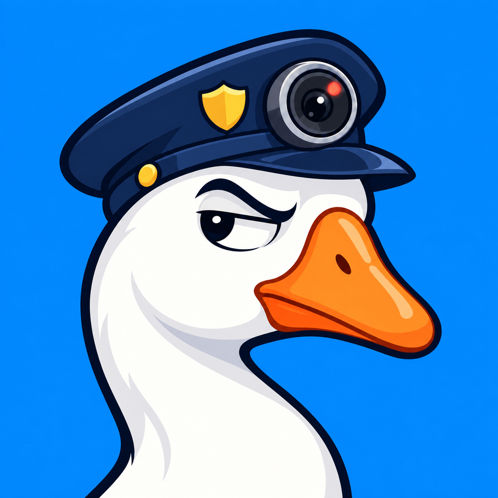

# 离席守护 · DeskGuard



在自己的 Windows 电脑上手动布防，检测输入活动并将摄像头照片保存在本机。

**A manually armed, local-only Windows activity-triggered camera helper. No keystroke content, audio recording, or uploads.**

**鹅已掌握证据。** 保安鹅的工作态度是：“你继续，鹅看着呢。” 现在可以选择桌面巡逻或静默保护。巡逻时桌面鹅沿屏幕边缘踱步；静默时隐藏桌宠，防护照常运行。完整变更见 [更新记录](CHANGELOG.md)。桌宠图像与应用图标均由内置图像工具为本项目生成。

## 下载与使用

适用于 **Windows 10 / 11 x64**。便携版通常无需安装、无需管理员权限，也无需另装 Python。

1. 在 [Releases](https://github.com/42-0p6180339887/deskguard/releases/latest) 下载便携版 ZIP，将整个文件夹解压到可写位置。如果尚未发布版本，可按下方说明从源码运行。
2. 双击 `DeskGuard.exe`，点击“测试拍照”，确认镜头和照片保存正常。
3. 点击“开始布防”。默认倒计时 **15 秒**，结束后窗口收起到系统托盘；检测到输入活动时保存照片，最短间隔默认 **3 秒**。
4. 返回后按 **Ctrl + Alt + F9** 停止，再查看照片。

完整步骤与本机验收见 [使用说明](docs/USER_GUIDE.zh-CN.md)。

## 功能

- 鼠标、键盘活动触发拍照；触屏支持需在目标设备测试。
- 默认过滤 Windows 标记的模拟输入，尽量减少 Codex 等自动化工具触发；也提供会话活动兼容模式。
- 托盘菜单控制启停、显示窗口和退出。**Ctrl + Alt + F9** 布防 / 停止，**Ctrl + Alt + F10** 显示 / 隐藏；快捷键冲突时可使用托盘菜单。
- 桌宠模式可选“静默保护”或“鹅鹅巡逻”。鹅只在实际布防时出现，沿主屏幕边缘巡逻；它不接收鼠标点击、不抢键盘焦点，不影响 Codex 自动化输入，也不触发拍照。
- 保安鹅图标保持静态；将鼠标停在托盘图标上查看文字状态，或打开主窗口确认布防状态。图案中的红点是装饰，不代表摄像头正在拍摄。
- 普通控制窗口，不置顶；点击窗口右上角 × 会完全退出。
- 照片按日期分目录，默认容量上限 **2 GiB**。达到上限或磁盘空间不足时停止，不自动删除旧照片。
- 可在布防期间请求保持电脑唤醒，允许屏幕熄灭；检测到锁屏或 UAC 安全桌面时暂停拍摄，返回后重新倒计时。

## 行为与边界

程序启动时未布防，摄像头不会自动开启。只有选择“测试拍照”或“开始布防”才会启用；布防期间保持摄像头会话，触发才存照片。无快门声、无逐次弹窗，保留 Windows 权限与摄像头硬件指示灯的正常行为。

照片以普通、未加密的 JPEG 保存，默认位置为程序旁的 `Photos/YYYY-MM-DD/`；`Photos/events.jsonl` 只记录时间、文件名和触发原因。设置保存在 `settings.json`。程序不读取或保存按键内容，不录音、不主动上传照片，也不设置开机自启。选择同步文件夹或网络共享目录时，其他软件或系统服务仍可能传输照片。它面向自己拥有或获授权管理的设备，是活动记录辅助工具，不能阻止他人操作或保护未锁定的桌面。

输入过滤不能证明操作来自真人，也不能保证排除所有自动化。兼容模式包含模拟输入，触屏与多指手势覆盖需实测。锁屏检测采用轮询，进行中的拍照可能有短暂处理延迟，不能作为严格的安全边界。普通桌面以外、睡眠或关机期间不提供拍照保证；保持唤醒请求不会阻止手动睡眠、合盖或系统策略生效。

如果 Codex 需要操作 Windows 图形界面，设备仍须保持解锁，目标应用可见。见 [OpenAI 的电脑操作说明](https://learn.chatgpt.com/use-cases/use-your-computer-with-codex)。

## 从源码运行

在 Windows x64 上安装 **Python 3.12 的官方安装版**，包含 Tcl/Tk；项目使用 Python 标准库，无需安装第三方 Python 包。构建摄像头组件需要系统的 .NET Framework C# 编译器及 Windows WinMetadata。

在仓库根目录执行：

```powershell
powershell -File build_camera.ps1
python app.py
```

运行离线测试：

```powershell
python -m unittest discover -s tests -v
```

构建便携发布包：

```powershell
python build_release.py --output dist
```

构建细节见 [开发说明](docs/DEVELOPMENT.md)。生成的可执行文件、运行环境和发布 ZIP 不提交到源码仓库；发布包通过 GitHub Actions 构建并提供。

## 验证状态

项目包含离线测试，覆盖输入过滤、照片存储、异常清理、托盘恢复和发布包隔离。各版本已完成的检查见 [验证记录](docs/VALIDATION.zh-CN.md)。自检使用模拟图像，**尚未进行真实摄像头、输入钩子、触屏及 Codex 共存的硬件实测**。通过离线测试不代表所有设备和输入场景可用；首次使用请按使用说明完成本机验收。

## 许可

项目源码、文档及为本项目生成的保安鹅图标与桌宠图像（`assets/deskguard.png`、`assets/deskguard.ico`、`assets/deskguard-pet.png`）均按 [MIT License](LICENSE) 提供。图像由内置图像工具生成。便携包中 Python、Tcl/Tk 及其他运行时组件保留各自的许可；见 [第三方声明](THIRD_PARTY_NOTICES.md)。
